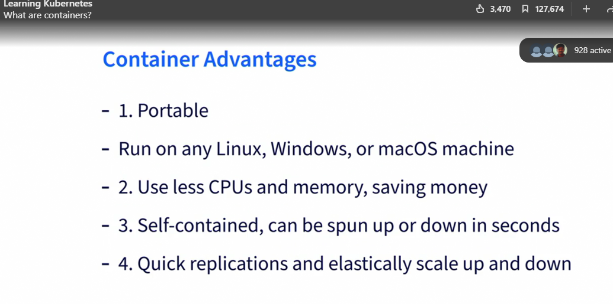

Container Advantages 

<table>
  <tr>
    <th>Container Advantages</th>
    <td>
     
      </td>
  </tr>
  <tr>
    <td>
      <ol>
        <li><strong>Portable</strong> 
        Run on any Linux, Windows, or macOS machine.</li>
         
        <li><strong>Use less CPUs and memory, saving money</strong> 
        Containers are lightweight and consume fewer system resources compared to virtual machines.</li>
         
        <li><strong>Self-contained, can be spun up or down in seconds</strong> 
        Containers include all necessary components (code, runtime, libraries, etc.) and can be quickly started or stopped without affecting other containers or the host system.</li>
         
        <li><strong>Quick replications and elastically scale up and down</strong> 
        Containers can be easily replicated and scaled horizontally or vertically using container orchestration tools.</li>
      </ol>
    </td>
  </tr>
</table>